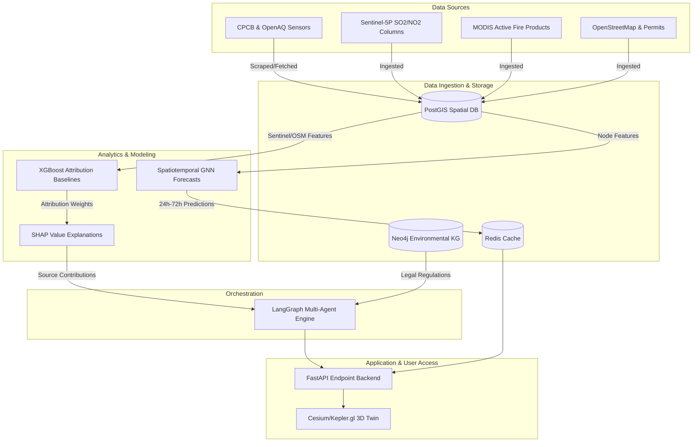
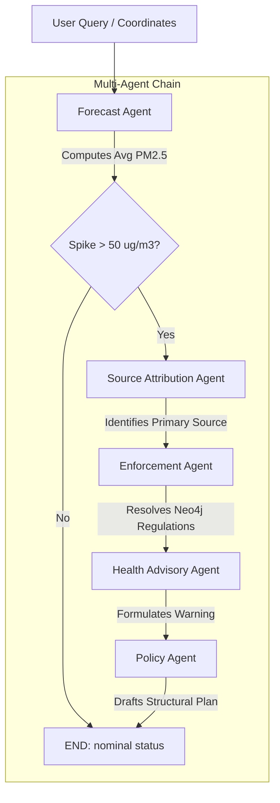

# System Architecture: Urban Air Quality Intelligence Platform

This document details the software architecture, database schemas, machine learning design, and multi-agent workflow systems deployed for Smart Cities Mission, CPCB, State Pollution Control Boards, and Municipal Corporations.

---

## 1. High-Level Architecture Diagram



---

## 2. Multi-Agent Reasoning Loop

The orchestration engine uses **LangGraph** to coordinate 5 specialized, collaborative agents in response to localized warnings:



### Shared State Schema (`AgentState`)
The agent state container holds the full context passed between nodes:
* `lat`, `lon`, `hours`: Geographic target variables.
* `query`: Admin or citizen prompt details.
* `forecast`: Raw predictions for PM2.5, PM10, SO2, NO2, and AQI.
* `attribution`: Breakdown of the 6 sources (Traffic, Construction, Industrial, Waste, Biomass, Crop residue).
* `enforcement_plan`: Neo4j matched bans, inspection target coordinates, and estimated drop in PM2.5 levels.
* `health_advisory`: Demographic alerts, mandatory actions, and peak exposures.
* `policy_plan`: Long-term regulatory amendments and municipal budgets.
* `spike_detected` & `primary_source`: Flags guiding the execution branches.
* `messages`: Full runtime interaction history.

---

## 3. Neo4j Knowledge Graph Schema

The **Neo4j Environmental Knowledge Graph** represents the semantic relationships within the urban environment.

### Entity Model (Nodes)
* **`City`**: Urban district node (e.g. `Delhi`, `Bangalore`).
* **`Ward`**: Municipal demarcation (e.g. `Ward 1 - Central`).
* **`MonitoringStation`**: Station metadata (lat, lon, station code).
* **`Pollutant`**: Environmental indicators (`PM2.5`, `PM10`, `NO2`, `SO2`) with national limits.
* **`Industry`**: Emitting factories (production type, stack emission rates).
* **`ConstructionSite`**: Active permits and developmental progress.
* **`TrafficCorridor`**: Grid highways (congestion density, road classification).
* **`PopulationCluster`**: Densely habitated sectors (vulnerability indices).

### Relationship Model (Edges)
* **`LOCATED_IN`**: Connects stations, industries, sites, corridors, and wards to parent regions.
* **`CONNECTED_TO`**: Identifies boundary wards that impact each other via wind vectors.
* **`CAUSES`**: Links emission nodes (`Industry`, `ConstructionSite`, `TrafficCorridor`) to target `Pollutants` with categorical metrics (`High`, `Medium`).
* **`IMPACTS`**: Links `Pollutants` to downstream `PopulationClusters` with severity levels.
* **`INFLUENCES`**: Tracks traffic corridor alignments that feed directly into specific `MonitoringStation` readings.

---

## 4. Key Traversal Logic (Cypher Queries)

### Impact Analysis
Traces how a specific source node causes pollutants that impact vulnerable population clusters downstream:
```cypher
MATCH path = (s)-[:CAUSES]->(p:Pollutant)-[:IMPACTS]->(pop:PopulationCluster)
WHERE s.name =~ $regex OR labels(s)[0] =~ $regex
RETURN id(s) AS source_id, labels(s)[0] AS source_type, s.name AS source_name,
       p.name AS pollutant_name, pop.name AS target_name, pop.density AS target_density,
       pop.vulnerability_index AS vulnerability
```

### Root Cause Tracing
Determines all upstream emitters within 3 degrees of connectivity from an affected cluster or station:
```cypher
MATCH path = (s)-[*1..3]->(t)
WHERE (t:PopulationCluster OR t:MonitoringStation)
  AND (t.name =~ $regex)
  AND (s:Industry OR s:ConstructionSite OR s:TrafficCorridor)
RETURN t.name AS target_name, labels(t)[0] AS target_type,
       s.name AS source_name, labels(s)[0] AS source_type,
       s.type AS ind_type, s.road_type AS road_type
```
